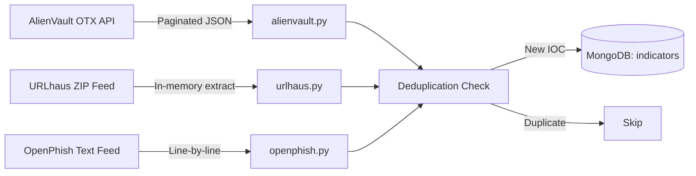
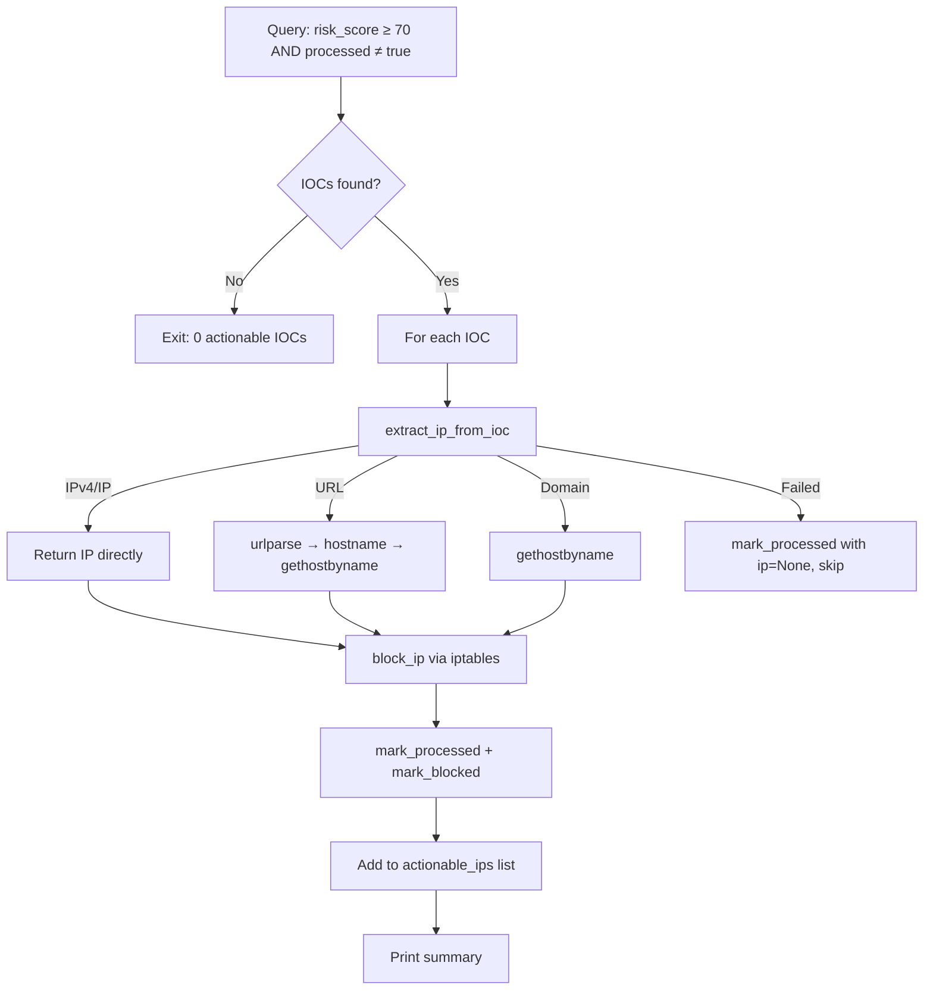
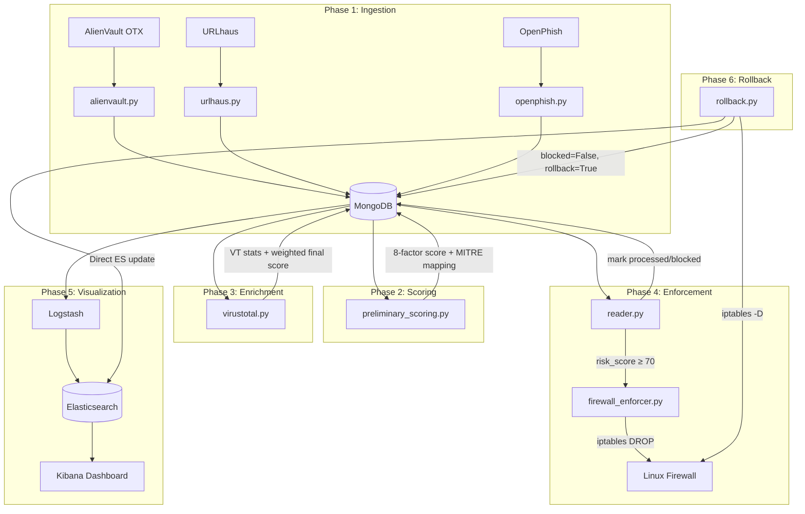

# Advanced Threat Intelligence Platform (ATIP)
# Architectural Document

> **Project Root:** `/home/kali/Advanced_Threat_Intelligence_Platform/`
> **Author:** ATIP Development Team
> **Last Updated:** June 4, 2026

---

## 1. Executive Summary

The **Advanced Threat Intelligence Platform (ATIP)** is a Python-based security operations system that automates the end-to-end lifecycle of threat intelligence — from ingesting open-source threat feeds, through risk scoring and MITRE ATT&CK mapping, to automated firewall enforcement and rollback capabilities. The platform uses MongoDB as its primary data store, Elasticsearch + Kibana (ELK) as its SIEM visualization layer, and Logstash as the data synchronization pipeline between them.

---

## 2. Project Directory Structure

```
Advanced_Threat_Intelligence_Platform/
│
├── .env                          # Environment variables (credentials, API keys)
├── .env.example                  # Template for .env
├── .gitignore
├── requirements.txt              # Python dependencies
├── docker-compose.yml            # Container orchestration (5 services)
├── logstash.Dockerfile           # Custom Logstash image with MongoDB plugin
├── main.py                       # Reserved entry point
├── clear_db.py                   # Utility: wipe all MongoDB documents
├── clear_es.sh                   # Utility: wipe Elasticsearch indices + Logstash tracker
├── README.md
│
├── database/                     # Database abstraction layer
│   ├── __init__.py
│   ├── init.py
│   ├── mongo_handler.py          # MongoDB connection singleton
│   ├── elasticsearch_handler.py  # Elasticsearch direct-update helper
│   └── test_connection.py        # Connection verification utility
│
├── feeds/                        # Open threat feed extractors
│   ├── alienvault.py             # AlienVault OTX pulse ingestion
│   ├── urlhaus.py                # URLhaus malware URL ingestion
│   ├── openphish.py              # OpenPhish phishing URL ingestion
│   └── virustotal.py             # VirusTotal enrichment + scoring
│
├── scoring/                      # Risk scoring engine
│   ├── preliminary_scoring.py    # Multi-factor preliminary scorer
│   └── mitre/
│       ├── enterprise-attack.json  # MITRE ATT&CK knowledge base
│       ├── mitre_parser.py         # Raw technique extractor
│       └── technique_mapper.py     # Singleton mapper (malware→techniques)
│
├── week3/                        # Operational pipeline (reader + enforcement)
│   ├── config.py                 # Risk threshold configuration
│   ├── reader.py                 # High-risk IOC reader + enforcement trigger
│   ├── tracker.py                # State tracker (mark processed/blocked)
│   ├── utils.py                  # IOC-to-IP resolver
│   └── reset_processed.py       # Reset all processing flags
│
├── firewall/                     # Firewall enforcement
│   └── firewall_enforcer.py      # iptables automation + daemon mode
│
├── rollback/                     # Rollback operations
│   └── rollback.py               # IP unblock + DB/SIEM state reversal
│
├── logstash/
│   └── pipeline/
│       └── logstash.conf         # Logstash pipeline: MongoDB → Elasticsearch
│
└── outputs/
    └── latest_urlhaus.json       # Exported URLhaus data snapshot
```

---

## 3. Infrastructure & Container Stack

All infrastructure services are orchestrated via `docker-compose.yml`, running on a shared `elk-network` bridge.

### 3.1 Services Overview

| Service | Image | Container Name | Port | Purpose |
|---------|-------|---------------|------|---------|
| MongoDB | `mongo:4.4` | `atip-mongodb` | `27017` | Primary data store for all IOC documents |
| Mongo Express | `mongo-express:latest` | `atip-mongo-gui` | `8081` | Web-based MongoDB admin GUI |
| Elasticsearch | `elasticsearch:8.12.0` | `elasticsearch` | `9200` | Search/analytics engine for SIEM |
| Logstash | Custom build | `logstash` | — | Data sync pipeline (MongoDB → ES) |
| Kibana | `kibana:8.12.0` | `kibana` | `5601` | SIEM visualization dashboard |

### 3.2 Logstash Custom Dockerfile

**File:** `logstash.Dockerfile`

The default Logstash image does not include the MongoDB input plugin. A custom Dockerfile:

1. Starts from `logstash:8.12.0`
2. Switches to `root` to create `/opt/logstash-mongodb/` with correct ownership
3. Switches back to `logstash` user for security
4. Installs `logstash-input-mongodb` plugin

### 3.3 Environment Configuration

**File:** `.env`

Stores all sensitive credentials:
- `MONGO_USERNAME` / `MONGO_PASSWORD` — MongoDB authentication
- `MONGO_HOST` / `MONGO_PORT` / `MONGO_AUTH_DB` — Connection parameters
- `OTX_API_KEY` — AlienVault OTX API key
- `VT_API_KEY` — VirusTotal API key

---

## 4. Database Layer

### 4.1 MongoDB Handler — `database/mongo_handler.py`

**Purpose:** Centralized MongoDB connection singleton used by all modules.

**Core Logic:**
- Loads credentials from `.env` using `python-dotenv`
- Constructs a MongoDB URI with optional authentication
- Connects to database `threat_intel`, collection `indicators`
- Exports a shared `collection` object imported by all other scripts

```python
# Connection pattern used across all modules:
from database.mongo_handler import collection
```

### 4.2 Elasticsearch Handler — `database/elasticsearch_handler.py`

**Purpose:** Direct Elasticsearch update helper for real-time SIEM sync.

**Core Logic:**
- Uses `_update_by_query` REST API to update ES documents by their MongoDB `_id`
- Builds Painless scripts dynamically from the update fields dictionary
- Called by `tracker.py` and `rollback.py` to keep ES in sync without waiting for Logstash

**Function:** `update_elasticsearch_docs(doc_ids, update_fields)`
- Takes a list of document IDs and a dict of fields to update
- Constructs a Painless script: `ctx._source.<field> = params.<field>` for each field
- Sends POST to `threat-intel-indicators-*/_update_by_query`

### 4.3 MongoDB Document Schema

Each IOC document in the `indicators` collection follows this schema:

| Field | Type | Set By | Description |
|-------|------|--------|-------------|
| `indicator` | string | Feed scripts | The IOC value (IP, URL, domain, hash) |
| `ioc_type` | string | Feed scripts | Type: `IPv4`, `url`, `domain`, `hostname`, `md5`, `sha256` |
| `source` | string | Feed scripts | Feed origin: `AlienVault OTX`, `URLHaus`, `OpenPhish` |
| `threat_type` | string | Feed scripts | Threat category or pulse name |
| `confidence` | string | Feed scripts | `high`, `medium`, `low` |
| `status` | string | Feed scripts | `active`, `offline`, etc. |
| `malware_family` | string | URLhaus | Identified malware family |
| `tags` | array | URLhaus | Associated tags |
| `pulse_id` | string | AlienVault | OTX pulse identifier |
| `author` | string | AlienVault | Pulse author |
| `created` / `first_seen` | string | Feed scripts | Timestamp from feed |
| `preliminary_score` | int | Scoring engine | Multi-factor preliminary risk score (1–100) |
| `preliminary_severity` | string | Scoring engine | `Critical`/`High`/`Medium`/`Low` |
| `mitre_techniques` | array | Scoring engine | Mapped MITRE ATT&CK techniques |
| `vt_enriched` | bool | VirusTotal | Whether VT enrichment has been applied |
| `vt_malicious` | int | VirusTotal | VT malicious detections count |
| `vt_suspicious` | int | VirusTotal | VT suspicious detections count |
| `vt_harmless` | int | VirusTotal | VT harmless detections count |
| `vt_reputation` | int | VirusTotal | VT reputation score |
| `vt_tags` | array | VirusTotal | VT-assigned tags |
| `risk_score` | int | VirusTotal | Final weighted risk score (1–100) |
| `risk_severity` | string | VirusTotal | Final severity label |
| `processed` | bool | Reader/Tracker | Whether reader has actioned this IOC |
| `resolved_ip` | string | Reader | Resolved IP address for URL/domain IOCs |
| `processed_time` | datetime | Tracker | When processing occurred |
| `blocked` | bool | Tracker | Whether firewall block was applied |
| `rollback` | bool | Rollback | Whether a rollback has been performed |
| `rollback_time` | datetime | Rollback | When rollback occurred |

---

## 5. Open Threat Feed Extraction Modules

All feed scripts live in `feeds/` and follow a common pattern:
1. Fetch data from the external API/feed
2. Parse and normalize into the document schema
3. Deduplicate against existing MongoDB records
4. Insert new indicators into the `indicators` collection

### 5.1 AlienVault OTX — `feeds/alienvault.py`

**Feed URL:** `https://otx.alienvault.com/api/v1/pulses/subscribed`
**Authentication:** API key via `X-OTX-API-KEY` header

**Core Logic:**
1. **Paginated Fetching** — Iterates up to `MAX_PAGES = 5` pages of subscribed pulses
2. **Pulse Parsing** — Each pulse contains metadata (`name`, `id`, `author`, `created`) and an `indicators` array
3. **Indicator Extraction** — For each indicator, extracts `indicator` value and `ioc_type`
4. **Document Construction** — Builds document with source=`AlienVault OTX`, confidence=`medium`, status=`active`
5. **Deduplication** — Checks `collection.find_one({"indicator": indicator})` before insert
6. **Summary** — Prints pages processed, new inserts, and duplicates skipped

**IOC Types Ingested:** IPv4, domain, hostname, URL, FileHash-MD5, FileHash-SHA256

### 5.2 URLhaus — `feeds/urlhaus.py`

**Feed URL:** `https://urlhaus.abuse.ch/downloads/json/`
**Authentication:** None (public feed)

**Core Logic:**
1. **ZIP Download** — Feed is delivered as a ZIP archive containing JSON
2. **In-Memory Extraction** — Uses `zipfile.ZipFile(io.BytesIO(response.content))` to extract without disk I/O
3. **Entry Parsing** — Each entry contains `url`, `threat`, `tags`, `dateadded`, `url_status`
4. **Malware Family Extraction** — Scans tags, skipping architecture tags (`32-bit`, `elf`, `exe`, `mips`, etc.) to find the malware family name
5. **Processing Limit** — Caps at `MAX_ENTRIES = 200`
6. **Deduplication** — Same pattern as AlienVault
7. **JSON Export** — Exports ingested data to `outputs/latest_urlhaus.json`

**IOC Types Ingested:** URLs (malware distribution)

### 5.3 OpenPhish — `feeds/openphish.py`

**Feed URL:** `https://openphish.com/feed.txt`
**Authentication:** None (public feed, custom User-Agent: `TIP-Project`)

**Core Logic:**
1. **Plain-Text Fetch** — Feed is a newline-delimited list of phishing URLs
2. **Line-by-Line Parsing** — `response.text.splitlines()` extracts individual URLs
3. **Document Construction** — All entries get ioc_type=`url`, source=`OpenPhish`, threat_type=`phishing`, confidence=`high`
4. **Processing Limit** — Caps at `MAX_ENTRIES = 300` inserted (not processed)
5. **Deduplication** — Same pattern

**IOC Types Ingested:** URLs (phishing)

### 5.4 VirusTotal Enrichment — `feeds/virustotal.py`

**API Base:** `https://www.virustotal.com/api/v3/`
**Authentication:** API key via `x-apikey` header

> **Note:** This module is both a feed enricher and a scoring component. It queries VT for existing IOCs rather than ingesting new ones.

**Core Logic:**

1. **Prioritized Selection** — Fetches up to `MAX_IOCS = 50` un-enriched indicators, prioritizing IPs first (sorted by `preliminary_score` descending), then filling remaining slots with non-IP IOCs

2. **Dynamic URL Construction** (`get_vt_url`):
   - `domain`/`hostname` → `/domains/{indicator}`
   - `ipv4`/`ip` → `/ip_addresses/{indicator}`
   - `url` → `/urls/{base64_encoded}`
   - `md5`/`sha256` → `/files/{indicator}`

3. **VT Score Calculation** (`calculate_vt_score`):
   - ≥20 malicious OR ≥25 total → **100**
   - ≥10 malicious OR ≥15 total → **90**
   - ≥5 malicious OR ≥8 total → **80**
   - ≥5 suspicious → **70**
   - ≥1 suspicious → **60**
   - ≥1 malicious → **50**
   - ≥5 harmless → **20**
   - Otherwise → falls back to preliminary score

4. **Weighted Final Score**:
   ```
   weighted_score = (preliminary_score × 0.4) + (vt_score × 0.6)
   final_score = max(vt_score, weighted_score) if vt_score ≥ 80 else weighted_score
   ```

5. **Fallback Scoring** — All remaining un-enriched IOCs get their `preliminary_score` promoted to `risk_score`

6. **Rate Limiting** — 2-second sleep between API calls; stops on HTTP 429

---

## 6. MongoDB Ingestion Pipeline



**Execution Order:**
```bash
# Step 1: Ingest feeds
python3 feeds/alienvault.py
python3 feeds/urlhaus.py
python3 feeds/openphish.py

# Step 2: Score
python3 scoring/preliminary_scoring.py

# Step 3: Enrich with VirusTotal
python3 feeds/virustotal.py
```

---

## 7. Preliminary Scoring Engine — `scoring/preliminary_scoring.py`

### 7.1 Overview

The preliminary scoring engine calculates a risk score (1–100) for every newly ingested indicator using **8 weighted factors** before any external enrichment (VirusTotal).

### 7.2 Scoring Factors

| # | Factor | Logic | Score Range |
|---|--------|-------|-------------|
| 1 | **Source Reliability** | URLhaus=60, OpenPhish=55, AlienVault=50, default=40 | 40–60 |
| 2 | **IOC Type** | File hashes=15, URLs=10, domains=5, IPs=0 | 0–15 |
| 3 | **Malware Family Bonus** | +10 if known malware family (not "unknown") | 0–10 |
| 4 | **Threat Keyword Analysis** | Scans `threat_type` + `tags` for keywords like `ransomware`(+15), `c2`(+15), `stealer`(+12), `trojan`(+10), etc. | 0–15 per keyword |
| 5 | **Tag Count Bonus** | `min(10, unique_tags × 2)` | 0–10 |
| 6 | **Confidence Bonus** | high=+5, medium=0, low=−10 | −10 to +5 |
| 7 | **Age Decay** | <24h=+10, <72h=+7, <7d=+3, <30d=−5, >30d=−10 | −10 to +10 |
| 8 | **Structural Jitter** | `(len(indicator) % 5) - 2` to prevent identical scores | −2 to +2 |

**Final score:** Clamped to `max(1, min(100, score))`

### 7.3 Severity Labels

| Score Range | Severity |
|-------------|----------|
| 90–100 | Critical |
| 70–89 | High |
| 40–69 | Medium |
| 1–39 | Low |

### 7.4 MITRE ATT&CK Technique Mapping

**File:** `scoring/mitre/technique_mapper.py`

The `MITRETechniqueMapper` is a **singleton class** that loads the full MITRE ATT&CK Enterprise knowledge base (`enterprise-attack.json`) and builds three in-memory indices:

1. **`malware_index`** — Maps malware aliases (lowercase) → STIX IDs
2. **`technique_index`** — Maps STIX IDs → technique details `{id, name, description}`
3. **`relationship_index`** — Maps malware STIX IDs → associated technique STIX IDs

**Two mapping methods:**
- `map_malware_to_techniques(name)` — Looks up malware by alias, traverses relationships to find techniques
- `map_text_to_techniques(text)` — Uses pre-compiled regex patterns to match keywords like `phish`→T1566, `ransomware`→T1486, `c2`→T1071.001, etc.

During scoring, both methods are called and results are deduplicated by technique ID.

---

## 8. Reader & Enforcement Module — `week3/reader.py`

### 8.1 Purpose

The reader module bridges scoring and enforcement. It queries MongoDB for high-risk IOCs that haven't been processed yet, resolves them to IP addresses, triggers firewall blocking, and updates document state.

### 8.2 Core Logic Flow



### 8.3 Configuration

**File:** `week3/config.py`
```python
RISK_THRESHOLD = 70
```

### 8.4 IP Resolution — `week3/utils.py`

The `extract_ip_from_ioc(ioc, ioc_type)` function resolves any IOC to an IP:
- **IPv4/IP** → Returns the indicator directly
- **URL** → Parses hostname via `urlparse`, resolves via `socket.gethostbyname`
- **Domain/Hostname** → Resolves directly via `socket.gethostbyname`

### 8.5 State Tracking — `week3/tracker.py`

Two functions that update both MongoDB **and** Elasticsearch in real-time:

- **`mark_processed(doc_id, ip)`** — Sets `processed=True`, `resolved_ip`, `processed_time` in both MongoDB and ES
- **`mark_blocked(doc_id)`** — Sets `blocked=True` in both MongoDB and ES

---

## 9. Firewall Enforcement — `firewall/firewall_enforcer.py`

### 9.1 IP Blocking Function

`block_ip(ip_address)`:
1. **Check existing rule:** `sudo iptables -C INPUT -s <ip> -j DROP`
2. **If exists (rc=0):** Skip — already blocked
3. **If not (rc≠0):** Execute `sudo iptables -A INPUT -s <ip> -j DROP`

### 9.2 Daemon Mode

When run as `__main__`, the enforcer enters a **continuous loop**:
1. Imports `reader.main` (deferred import to break circular dependency)
2. Calls `run_database_sync()` every **60 seconds**
3. Each cycle queries for new high-risk IOCs and blocks them

### 9.3 Systemd Service

A service unit file enables running the enforcer as a system daemon:
```ini
[Unit]
Description=Threat Intelligence Firewall Enforcer
After=network.target

[Service]
Type=oneshot
RemainAfterExit=yes
ExecStart=/usr/bin/python3 /home/kali/Advanced_Threat_Intelligence_Platform/firewall/firewall_enforcer.py

[Install]
WantedBy=multi-user.target
```

---

## 10. Rollback Module — `rollback/rollback.py`

### 10.1 Purpose

Provides the ability to **reverse** a firewall block — removing the iptables rule and updating all database records to reflect the rollback.

### 10.2 Execution

```bash
python3 rollback/rollback.py <ip_address>
```

### 10.3 Core Logic (5 Steps)

| Step | Action | Detail |
|------|--------|--------|
| **0** | Input Validation | Validates IPv4 format via regex `^(?:[0-9]{1,3}\.){3}[0-9]{1,3}$` |
| **1** | Database Lookup | `collection.find({"resolved_ip": ip, "blocked": True})` |
| **2** | Display Records | Shows all matching blocked records with indicator, type, and score |
| **3** | Firewall Unblock | `iptables -C` to check rule exists, then `iptables -D INPUT -s <ip> -j DROP` |
| **4** | MongoDB Update | `update_many` → sets `blocked=False`, `processed=False`, `rollback=True`, `rollback_time=<utc_now>` |
| **5** | SIEM Sync | Calls `update_elasticsearch_docs()` to push rollback state to Elasticsearch |

### 10.4 State Change Summary

| Field | Before Rollback | After Rollback |
|-------|----------------|----------------|
| `blocked` | `True` | `False` |
| `processed` | `True` | `False` |
| `rollback` | — | `True` |
| `rollback_time` | — | UTC timestamp |
| iptables rule | `DROP` active | Rule deleted |

---

## 11. Logstash Data Pipeline — `logstash/pipeline/logstash.conf`

### 11.1 Purpose

Logstash continuously syncs data from MongoDB to Elasticsearch, enabling Kibana visualization.

### 11.2 Pipeline Stages

**INPUT** — MongoDB plugin reads from `threat_intel.indicators`:
- URI with authentication via environment variables
- SQLite tracking DB at `/opt/logstash-mongodb/logstash_sqlite.db`
- Batch size: 5000

**FILTER** — Data transformation:

| Filter | Purpose |
|--------|---------|
| `_id` → `indicator_id` | Extracts MongoDB ObjectId string for use as ES document ID |
| Type conversions | Converts `risk_score`, `preliminary_score`, VT metrics to integers |
| MITRE flattening | Converts `mitre_techniques` array of objects → two arrays: `mitre_ids` and `mitre_names` |
| Boolean fix | Ruby filter converts surviving boolean fields to strings (plugin drops booleans) |
| Field cleanup | Removes redundant `log_entry` and `mongo_id` fields |

**OUTPUT** — Elasticsearch:
- Index pattern: `threat-intel-indicators-YYYY.MM.dd`
- Document ID: `%{indicator_id}` (enables upsert behavior)
- Also outputs to stdout with `rubydebug` codec for debugging

---

## 12. Utility Scripts

### 12.1 Clear MongoDB — `clear_db.py`
Deletes all documents from the `indicators` collection:
```python
result = collection.delete_many({})
```

### 12.2 Clear Elasticsearch — `clear_es.sh`
1. Queries all `threat-intel-indicators-*` indices
2. Deletes each index via REST API
3. Removes the Logstash SQLite tracking DB
4. Verifies clean state

### 12.3 Reset Processed Flags — `week3/reset_processed.py`
Removes `processed`, `resolved_ip`, `processed_time`, and `blocked` fields from all documents using `$unset`.

---

## 13. End-to-End Data Flow



---

## 14. Operational Runbook

### 14.1 Full Pipeline Execution Order

```bash
# 1. Start infrastructure
cd /home/kali/Advanced_Threat_Intelligence_Platform
sudo docker compose up -d

# 2. (Optional) Clean slate
python3 clear_db.py
bash clear_es.sh
sudo iptables -F INPUT

# 3. Ingest threat feeds
python3 feeds/alienvault.py
python3 feeds/urlhaus.py
python3 feeds/openphish.py

# 4. Score indicators
python3 scoring/preliminary_scoring.py

# 5. Enrich with VirusTotal
python3 feeds/virustotal.py

# 6. Enforce (one-shot)
python3 week3/reader.py

# 7. Restart Logstash to sync to Kibana
rm -f logstash/data/logstash_sqlite.db
sudo docker restart logstash

# 8. Rollback a specific IP (if needed)
python3 rollback/rollback.py <ip_address>
```

### 14.2 Daemon Mode (Continuous Enforcement)

```bash
python3 firewall/firewall_enforcer.py
# Or via systemd:
sudo systemctl start threat-enforcer
```

### 14.3 Kibana Access

- **URL:** `http://localhost:5601`
- **Index pattern:** `threat-intel-indicators-*`
- **Key fields for dashboards:** `risk_score`, `risk_severity`, `source`, `ioc_type`, `blocked`, `rollback`, `mitre_ids`, `mitre_names`

---

## 15. Technology Stack Summary

| Layer | Technology | Version |
|-------|-----------|---------|
| Language | Python 3 | System default |
| Primary Database | MongoDB | 4.4 |
| SIEM Search Engine | Elasticsearch | 8.12.0 |
| Data Pipeline | Logstash | 8.12.0 |
| Visualization | Kibana | 8.12.0 |
| Containerization | Docker Compose | v2 |
| Firewall | iptables | Linux kernel |
| OS | Kali Linux | Rolling |
